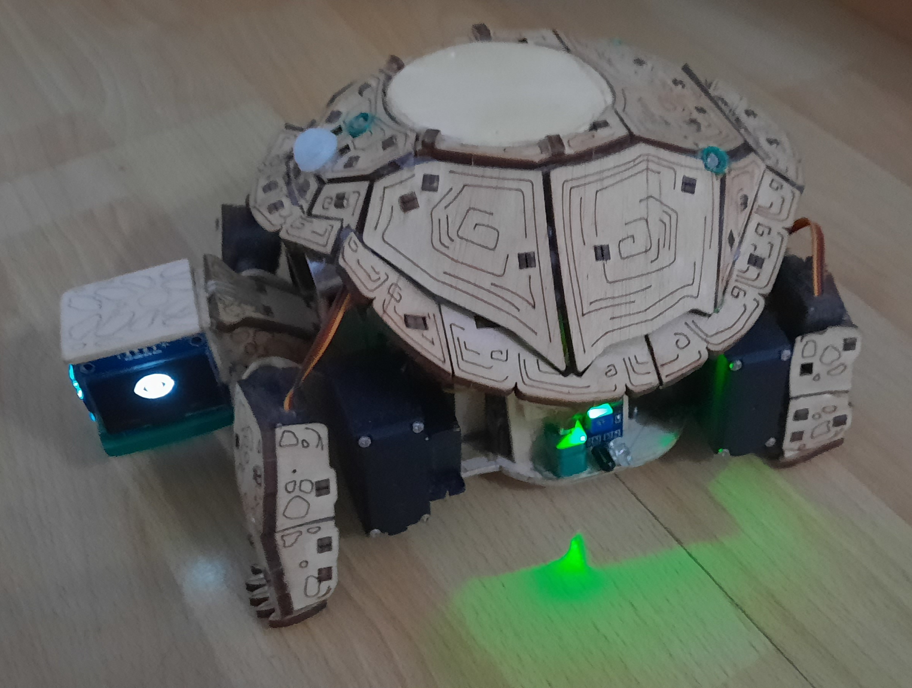
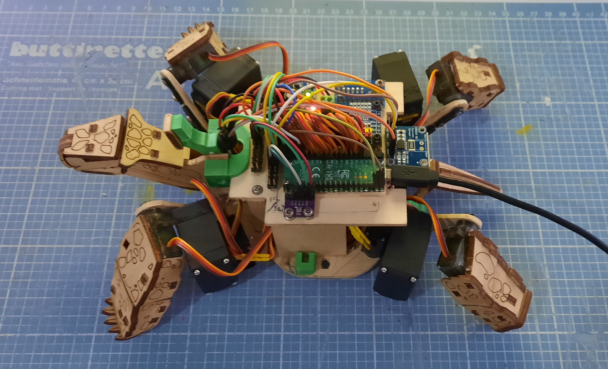
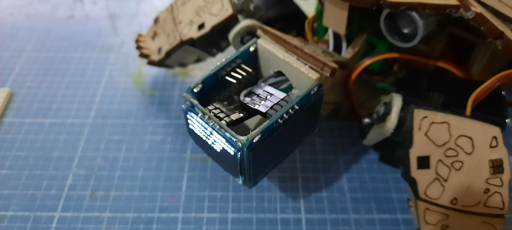
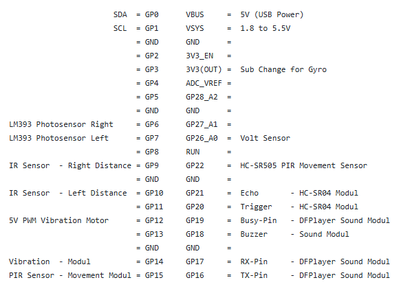

# Schildi

This Python-based project is a robotic pet designed to interact with and respond to its environment. By using a variety of sensors, the robot can perceive its surroundings, collect real-time data, and make intelligent decisions based on the detected conditions. 

It is capable of processing sensor inputs and performing appropriate actions, creating a more dynamic and interactive experience similar to a living companion.

-------------------------------------------------------------------------------------
 
The Base of that Project is a Raspberry Pi Pico W.

Main.py is the Main Programm how runs after start. It uses Librarys from: 
- dfplayer.py
- ds3231.py
- hcsr04.py
- mpu6050.py
- pca9685.py
- servo.py
- sh1106.py
- ssd1306.py

-------------------------------- Build in Modules ------------------------------------- 
- 3x HXJNLDC 3,7v 3000mah Battery
- 1x LM2577 Voltage Changer
- 2x LM393 Photosensor
- 2x IR Sensor
- 1x PWM vibration motor
- 1x HC-SR04 Modul
- 1x Volt Sensor
- 1x MPU6050 Gyro Modul
- 1x DFPlayer Modul
- 1x DS3231 Modul
- 1x PCA9685 Servo Controller
- 1x Flex Touch Sensor
- 2x 1.3inch xfp1116-07a y oled displays
- 1x SSD1306 Display
- 4x MG995 Servos
- 8x MG90 Servos
  

-------------------------------- Pin Assignment ------------------------------------- 

------------------------------- Adress Assignment -----------------------------------

#60  =  SH1106 Display  - Left/Right  - 1.3 inch xfp1116-07a y oled displays
#61  =  SSD1306 Display - Front

#64  =  PCA9685 Servo Controller

#72  =  16 Byte 4-Channel I2C IIC Analog-Digital-ADC-PGA-Wandler

#104 =  DS3231 Real Time Clock Modul for Raspberry Pi 

#105 =  MPU6050 Modul build in Temperatur-Sensor between -40°C bis +85°C  - 3,3V / 5V ~5mA

#112 =  PCA9685 Servo Controller

------------------------------- Power Usage -----------------------------------

- Raspberry Pi Pico W 2022								3.3V		70 - 120mA [Wlan on/off]
- MH Infrared Obstacle Sensor Module Flying Fisch RM2.20  					3.3 – 5V	20mA
- MH Infrared Obstacle Sensor Module Flying Fisch RM2.20  					3.3 – 5V	20mA
- PCF8591T AD/DA Convert Modul									3.3 – 5V	5mA
- HC-SR04 Ultrasonic Modul [Front]								5V		15mA
- MP3 Player Modul with Speaker						3,2 - 5V	20mA
- PCA9685 16 Channel 12 Bit PWM Servo Driver							3,3 - 5V	2mA
- GY-521 MPU6050 Gyro Module 					3.3V – 5V	3,9mA
- FSR Touch Sensor Modul FSR Sensor Modul/ Whadda WPSE477						3.3V – 5V	2mA
- DS3231 Real Time Clock Modul									2.3V – 5.5V	3mA   OnBoard Lithium Battery Typs CR927 (3V / 30mAh)
- PWM Vibration Modul					3.7V - 5.3V	90mA
- Gravity i2c 3.7v li battery fuel gauge								3.7V - 5.3V	3mA
- AZDelivery 0,96 Zoll OLED Display I2C - SSD1306 Chip Bildschirm					3.3 – 5V	30mA
- AZDelivery 0,96 Zoll OLED Display I2C - SSD1306 Chip Bildschirm					3.3 – 5V	30mA
- AZDelivery 0,96 Zoll OLED Display I2C - SSD1306 Chip Bildschirm					3.3 – 5V	30mA

Total without Servo:      393,9 mA/h
+Servos without Load:	   +176,0 mA/h

Total with max. Servo :   569,9 mA/h

